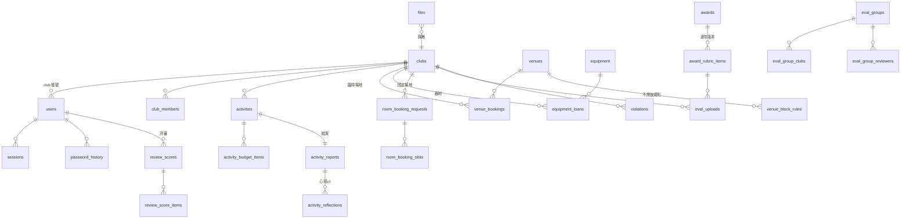

# club-aio 資料模型

PostgreSQL 18;schema 以 Alembic migration 為準,本文件是設計依據與欄位語意說明。

慣例:表名 snake_case 複數;主鍵預設為整數自增的 `id`,少數表以業務鍵或複合鍵為主鍵(下方逐表註明),`files`/`sessions` 用 uuid;所有表都有 `created_at`/`updated_at`(TIMESTAMPTZ);金額用 `integer`(新台幣元,無小數)。

## 0. 設計原則

1. **學年度掛軸**:評鑑、評分、分組等一年一輪的資料帶 `year`(民國學年度)。新學年開新輪,不覆寫舊資料。
2. **評分表逐年版本化**:rubric 綁 `(award, year)`。評分辦法年年微調,寫死在程式碼會導致每年改 code 且歷史成績對不上當年的表。
3. **推導優於儲存**:器材可借數、逾期、結案鎖定、競賽行政分一律即時計算,不存副本。需要人工介入處開明確的 override 表(如 `eval_adjustments`),保留「系統算的」與「人改的」兩層。
4. **狀態機 + 簽核紀錄分離**:單據存目前狀態一欄;每次核准/退回/解鎖寫一列 `approval_records`。狀態欄只是快照,歷程與退回原因全在紀錄表。
5. **檔案集中管理**:所有上傳檔進單一 `files` 表,磁碟路徑不進業務表。權限檢查、備份、日後搬物件儲存都只動一處。
6. **帳號單表**:四種角色共用 `users`,角色專屬欄位允許 NULL。登入、session、密碼歷史、稽核都以使用者為單位,拆四張表要重複四份。
7. **主檔不硬刪**:社團、場地、器材、獎項用 `is_active` 停用;已送審的流程單據永不刪除(草稿活動可刪,結案退回重送會整份取代)。
8. **遷移可重跑**:`legacy_id_map` 記錄舊系統 id → 新 id,migration scripts 據此 idempotent。

## 1. 舊系統實體覆蓋對照

功能至少涵蓋兩套舊系統是專案硬需求,對照如下:

| 舊系統 | 舊實體 | 新模型 |
|---|---|---|
| ClubManagementSystem | club, club_content, club_property | `clubs` |
| | student, teacher | `club_members`、`clubs.advisor_*` |
| | activity, activity_fund, activity_files, activity_images, activity_staff, activity_meta | `activities`、`activity_budget_items`、`files`、`activity_reports` |
| | news | `announcements` |
| | staff, club_token/staff_token, club/staff_password_history | `users`、`sessions`、`password_history` |
| | club_record_from_staff | `violations` |
| | audit_activity, audit_activity_record, staff_activity_log | `audit_logs`、`approval_records` |
| | calendar | `holidays` + `system_settings` |
| | viewer.AssessmentDuration | `system_settings.eval_window` |
| clubclass | classroom, classroom_rule | `venues`、`venue_block_rules` |
| | apply | `venue_bookings`、`room_booking_requests` |
| | device, device_apply, device_log | `equipment`、`equipment_loans`、`approval_records` |
| | admin, notice | `users`、`announcements` |

遷移範圍、筆數與對映見 `migration/README.md`。舊制密碼不可攜(sha256(密碼+帳號)),全帳號重發一次性密碼 + 首登強制改密。

## 2. ER 總覽



(申請三表、公告、稽核、設定為獨立弱關聯,圖中省略)

## 3. 資料表

### 3.1 帳號與身分

**users** — 四角色單表

| 欄位 | 型別 | 說明 |
|---|---|---|
| id | serial PK | |
| role | enum(`admin`,`staff`,`club`,`viewer`) | |
| username | text UNIQUE | |
| password_hash | text NULL | argon2id;SSO 帳號為 NULL |
| auth_provider | enum(`local`,`sso`) | 預設 `local` |
| name | text | 顯示名稱(社團帳號=社團名) |
| email | text NULL | |
| club_id | FK clubs NULL | 僅 role=club;部分唯一索引 `uq_users_club_id`(WHERE club_id IS NOT NULL)在 DB 層釘住一社一帳號 |
| is_super | bool | 僅 admin:最高權限 |
| permissions | text[] | 僅 admin。**頁面權限鍵一頁一把,單一真相在 `core/permissions.ADMIN_PAGES`**(隨 `/auth/me` 送給前端,前端不得另存一份);沒有「僅 super 可達」的頁面,super 仍全通。簽核關卡鍵 `approve_advisor`/`approve_chief`/`approve_dean` 寫在同一欄但不開頁、只開簽核動作,目錄在 `APPROVAL_STAGES`,權限彈窗與頁面權限一起授出(`super` 也不得代簽學務長關,所以只有這個入口)。**非 super 只授得出自己也持有的鍵**(`admin_accounts._check_grantable`),否則 `aaccount` 等同最高權限。檔案下載另依 `core/permissions.FILE_SUBJECT_KEYS` 對照檔案類型 |
| can_view_eval | bool | 僅 viewer |
| must_change_password | bool | 預設 true,首登強制改密 |
| is_active | bool | 停用而非刪除 |
| last_login_at | timestamptz NULL | |
| failed_login_attempts / locked_until | int / timestamptz NULL | 連錯 5 次鎖 15 分 |

**password_history**(user_id, password_hash)— 新密碼不得與近 3 代相同。

**sessions**(id uuid PK, user_id, csrf_token, ip, user_agent, expires_at)— cookie 值即 id,刪列即登出,停權立即生效;`csrf_token` 為 double-submit 的 session 綁定值。

### 3.2 社團與主檔

**clubs**

| 欄位 | 型別 | 說明 |
|---|---|---|
| id / name | serial PK / text UNIQUE | |
| kind | enum(社團,學會) | 負責人顯示詞(社長/會長)的推導依據。建立或改名時依名稱結尾自動推導,推導不到則手動指定 |
| en_name | text NULL | |
| attribute | enum(自治性,學藝性,服務性,聯誼性,藝術性,體育性) NULL | 公告分眾與統計;停社舊社團原性質不可考故可為 NULL |
| intro / website_url | text / text NULL | `website_url` 是行政分 ad6 的依據 |
| contact_emails | text[] | 至多 3 組、第 1 組必填;公告通知寄送對象 |
| discord_webhook_url | text NULL | 社團自設;該社事件只推這裡,NULL 即不推 |
| advisor_name / dept / email / ext | text NULL | 校內指導老師 |
| advisor_out_name / dept / email / phone | text NULL | 校外指導老師(校內外各至多一位) |
| suspended_until / suspend_reason | date NULL / text NULL | NULL=未停權 |
| is_active | bool | 退社/未立案=停用 |
| announcements_read_at | timestamptz NULL | 公告已讀水位線:`created_at` 晚於此者為未讀。一社一帳號故掛在 club |

社長不另設欄位,由 `club_members`(kind=負責人)推導;逾期次數同理由 `equipment_loans` 推導 —— 雙寫必然漂移。

**club_members**(id, club_id, name, student_id, kind enum(負責人,副負責人,幹部,社員), title text NULL, phone text NULL, semester text;UNIQUE(club_id, student_id, semester))

名單**按學期各自一份快照**,同學號可跨學期出現;ad5 依該學期快照的人數採計。`title` 幹部必填、其他身份選填。CSV 匯入指定學期,格式 `姓名,學號,身份[,職稱[,電話]]`,接受顯示詞(社長/會長)並映射為標準身份。

**venues**(id, name UNIQUE, capacity NULL, category enum(教室,練習空間,廣場戶外,宿舍區), allow_fixed, allow_temp, sort, is_active)

單一場地主檔,以旗標區分固定/臨時用途。目前只由 seed 建立,後台 CRUD 尚未實作(GAP-04),異動須改 seed 或直接操作 DB。

**equipment**(id, name UNIQUE, total_qty, max_lease_count int NULL, needs_serial bool, sort, is_active)

`needs_serial` 是唯一分類欄:false=一般點交、true=依序點交(點交畫面提醒核對序號,序號值不入系統)。`max_lease_count` 為單次可借上限,NULL=不限。可借數推導不儲存。

**venue_block_rules**(id, venue_id, start_date, end_date, weekdays smallint[] NULL, periods varchar(2)[], reason, created_by)

場地不開放規則。`weekdays` 為 ISO 1–7,NULL=區間內每天;`periods` 為不開放的節次子集。場況圖標示不開放、社團申請 422、核准 409 `SLOT_BLOCKED`;行政手動借用不受限。刪除為硬刪,異動走 `audit_logs`。

**holidays**(date PK, name)— 政府行事曆假日;器材逾期的「隔天上班日」與工作天緩衝都依此。**尚無匯入介面**,每年需以 script 或直接操作 DB 灌入;未匯入的年度會退化成只排除週六日。

**system_settings**(key PK, value jsonb)— 見 §4 設定分層。

### 3.3 活動申請與結案

**activities**

| 欄位 | 型別 | 說明 |
|---|---|---|
| id / club_id / created_by | | |
| name / content / location | text | |
| type | enum(社課或會議,活動) | 僅「活動」可勾大型 |
| is_large | bool | 社團自行勾選。定義:工作人員或服務對象 50 人以上/連辦 2–3 天或逾 20 小時/經費 10 萬以上/籌備 3 個月以上且 5 次以上籌備會議 |
| is_large_approved | bool NULL | 管理員審核時認可;**認可後行政分才享大型 ×3 加權** |
| date / end_date | date NULL | 活動起訖日;未跨日則相同。學期歸屬與 ad1「一天一件」皆以開始日推導 |
| start_time / end_time | time NULL | 開始時間屬 `date`、結束時間屬 `end_date` |
| participants_in / participants_out | int | 社員 / 非社員人數 |
| staff_text | text | 工作分配(自由格式) |
| fund_source / school_approved | text NULL / int NULL | 經費來源與核定補助,第一關認定 |
| status | enum,見下 | |
| close_unlocked | bool | 逾期鎖定的管理員解鎖旗標 |
| close_draft | jsonb NULL | 結案草稿(跨裝置續填),不含照片;送出結案時清除 |

金額與人數欄位一律有非負 CHECK(`ck_activities_amounts_non_negative`、`ck_activity_budget_items_amounts_non_negative`、`ck_activity_reports_counts_non_negative`;器材為 `ck_equipment_qty_non_negative` 與 `ck_equipment_loans_qty_positive` ≥1)—— schema 擋 API,匯入腳本與 raw SQL 由這層收口。

`date`/`end_date` 與 `name`/`location` 僅草稿可空,由 CHECK `ck_activities_draft_partial_only` 收口(`status='draft' OR (date, end_date 非空 AND name, location 非空字串)`);`start_time`/`end_time` 任何狀態皆可為 NULL,完整性由應用層在送出與非草稿更新時檢核。

狀態機:

```
draft
  → pending_advisor(待承辦人審核)
      ├─ 無申請補助(擬請補助=0):核准 → approved
      └─ 有申請補助:→ pending_chief(待組長) → pending_dean(待學務長) → approved
  任一關退回 → rejected(原因必填,可修改後重送)
approved → [社團送結案] → closing_pending_advisor(單關) → closed
                                                       └─ 退回 → approved(帶原因)
approved 且 end_date + N 天已過且未送結案 → 逾期鎖定(推導,非欄位;close_unlocked 可解鎖)
```

**activity_budget_items**(id, activity_id, category text, description, self_fund, requested_subsidy, approved_subsidy int NULL)

逐項編列,`approved_subsidy` 由承辦人關卡逐項核定。科目為 text + 目錄放 `system_settings`,不開表。

**activity_reports** — 結案成果調查,1:1 掛 activity

| 欄位 | 型別 | 說明 |
|---|---|---|
| activity_id | PK/FK | |
| member_count / non_member_count | int | 實際社員/非社員人數 |
| actual_start / actual_end | time | 實際起訖 |
| actual_location | text | |
| highlights / goals / others | text | 活動重點 / 如何達成目標 / 其他執行狀況 |
| review_meeting | bool | true 時 `review_date`、`review_attendees`、`review_topics`、`review_conclusion` 皆必填(應用層) |
| review_date / attendees / topics / conclusion | date / int / text / text,皆 NULL | |
| video_url | text NULL | **唯一選填**;http(s) 驗證。照片 <5 張且無影片 → ad2 該活動不計分 |
| expense | int | 實際支出(核銷依據) |
| submitted_at | timestamptz | |
| photos_confirmed / report_confirmed / reflections_confirmed | bool 預設 true | 承辦人核准結案時逐項確認繳交,**ad2–ad4 完全以這三個值為準**(D-14):系統不數照片張數也不數心得筆數,社團可能是交紙本。照片確認同時涵蓋影片連結;沒有 activity_reports 就沒有旗標可讀,三項一律不計 |

照片走 `files`(slot=`report_photo`),收所有常見影像格式(jpg/png/gif/webp/bmp/tiff/heic/heif/avif),魔術位元組與大小後端重驗,sha256 於同社團內跨活動拒重複。成果報告與心得 PDF 依模板於下載時動態生成,不落檔。

**activity_reflections**(id, report_id, student_name, dept, body)— 送審驗證 ≥3 筆,三欄皆必填。

**approval_records** — 全系統簽核軌跡

| 欄位 | 型別 | 說明 |
|---|---|---|
| subject_type | enum(activity, activity_close, room_booking, venue_booking, equipment_loan, officer_cert, postal_change, maintenance, signup) | |
| subject_id | int | |
| stage | text | advisor / chief / dean / single… |
| decision | enum(approve, reject, unlock, revoke) | |
| actor_id | FK users | |
| reason | text NULL | 退回必填(應用層) |

三關流程一單多筆紀錄、退回重送會產生多輪歷程,且「待審申請彙整」與稽核要跨單據查「誰核了什麼」——各單據自帶 `reviewed_by` 欄只記得住最後一次。

### 3.4 檔案

**files**

| 欄位 | 型別 | 說明 |
|---|---|---|
| id | uuid PK | 下載網址用 uuid,不可列舉 |
| club_id | FK NULL | 權限邊界 |
| uploaded_by | FK users | |
| subject_type / subject_id | text NULL / int NULL | 所屬單據 |
| slot | text NULL | 同單據內的位置(report_photo, evidence, passbook…) |
| original_name / size / mime | | |
| sha256 | text | 前端先算、後端驗證 |
| path | text | `{module}/{YYYY}/{MM}/{uuid}` |
| archived_at | timestamptz NULL | 已備份下載並自磁碟刪除;非 NULL 時下載回 410、不計配額 |

兩個 partial unique index 把去重收口在 DB 層,併發的先查後寫由索引攔下並回 409:

- `uq_files_club_report_photo_sha`(club_id, sha256)WHERE 未歸檔且 slot=`report_photo`
- `uq_files_club_eval_subject_sha`(club_id, subject_id, sha256)WHERE 未歸檔且 subject_type=`eval_upload`。範圍用 `subject_id`(rubric_item_id,逐年唯一)而非 slot,`item_key` 跨年度重複會誤擋隔年同內容的合法上傳

上傳配額於共用 `save_upload()` 收口:pg advisory xact lock 序列化配額檢查、宣告大小預檢 + 逐塊實際大小 + 磁碟空間 hard stop,超額回 507。

### 3.5 借用

**room_booking_requests**(id, club_id, venue_id, purpose, start_date, end_date, status enum(pending,approved,rejected,cancelled))
**room_booking_slots**(id, request_id, weekday int(1=週一…7=週日), period varchar(2):1–10、A–D;UNIQUE(request, weekday, period))

固定場地借用 = 整學期每週固定時段,選星期 × 時段而非日期。規則:

- 僅於受理期間(`system_settings.fixed_booking_window` 日期區間)受理**社團送件**;未開放時社團端入口反灰移至「其他」。行政端的審核不受期間限制
- 每社至多 **10 節**(1 節=1 小時);額度以「同一目標學期、狀態非 rejected/cancelled」的時段數合計,審核中與已核准都佔額度
- **晚間時段(第 10 節及 A–D 節)至少連續 3 節**:合法如 9–A、8–10、A–C、B–D;不合法如 9–10、C–D
- 多社可申請同時段,衝突由管理員**整單擇一核准**,不存在部分同意
- `start_date`/`end_date` 是申請時自動歸屬的目標學期起訖快照(依受理期間結束日推導,見 `booking_service.fixed_target_semester`);場況圖僅在此區間顯示已核准的固定借用,學期結束即不再佔格

**venue_bookings**(id, club_id NULL, venue_id, activity_id NULL, date, periods varchar(2)[], purpose, phone NULL, status)

臨時場地借用,單日多節次;綁定審核通過的活動。`club_id` NULL = 最高權限手動借用(顯示「學務處」),`activity_id` NULL 僅容舊資料與手動借用。

**equipment_loans**

| 欄位 | 說明 |
|---|---|
| id, club_id NULL, equipment_id, qty, phone NULL | 一單一品項;多品項=多單,點交與逾期各自獨立 |
| activity_id | FK activities NULL(容手動借用與舊系統已刪活動;新申請必填) |
| start_date / end_date | 借用區間 = 活動起訖 ∓ 工作天緩衝的**推導快照**;之後調整緩衝設定不回溯既有借用 |
| purpose | |
| status | enum(pending, approved, rejected, cancelled, checked_out, returned) |
| checkout_by / at / borrower_name | 借出點交(工讀生) |
| checkin_by / checkin_at / checkin_note / returner_name | 歸還點交 |

**逾期為推導**:status=checked_out 且 now ≥ (end_date 之隔天上班日的 `equipment_return_time`,預設 10:30)。逾期追蹤、停權管理、社團逾期數全查這裡;逾期未還的借用視為持續佔用,不論原區間是否已過。

社團可取消審核中或已核准未開始的借用(狀態 `cancelled`);臨時場地的可取消邊界是申請起始時刻(最早節次起點)。

固定借用(週期時段)、臨時場地(單日節次)、器材(區間+點交+逾期)的欄位與生命週期完全不同,故拆三表而非單表 + type。

### 3.6 其他申請

**officer_certificates**(id, club_id, term(如 114-2 或 114 全學年), position enum(社長或會長,副社長或副會長), applicant_name, status)— 姓名由成員名單依「學期 × 身份」自動帶出,0 或多位皆擋送出。

**postal_account_changes**(id, club_id, reasons text[](複選:更換代理人,新開戶,印鑑變更,帳簿遺失,結清銷戶,存簿密碼異動), account_name, account_number, new_agent_name NULL, new_agent_phone NULL, status)— 互斥組合由應用層驗證;存簿影本走 files(slot=`passbook`)。社團端自己的申請紀錄顯示完整局號帳號。

**maintenance_requests**(id, club_id, location, items, status enum(pending,in_progress,done), handle_note NULL)— 佐證照片/影片走 files(slot=`evidence`)。

幹部證明與郵局異動共用 **ApplicationStatus**:`pending`(審核中)→ `processing`(處理中)→ `completed`(請洽學務處)。**無退回**,學務處線下溝通後直接處理。

三者欄位、驗證、狀態機都不同,故用三張窄表而非 applications + JSONB。「待審申請彙整」頁目前由前端合併幹部證明與郵局異動兩個端點的結果,報修另有專頁。

### 3.7 線上報名與出席

管理員自由建立報名活動並定義表單欄位;社團點進活動子頁填寫,允許多人的活動可逐人新增至上限。

**signup_items**

| 欄位 | 說明 |
|---|---|
| id, name, description | 不存年度:ad7/ad8 以場次日期落在評鑑視窗推導採計 |
| is_open | 管理員可提前關閉 |
| event_at, place | 活動時間與地點 |
| signup_start / signup_end | 報名窗(建立時預設今天開始);各活動自訂,無全域報名窗 |
| max_participants | 每社名額上限,CHECK `ck_signup_items_capacity_min` ≥1 |
| fields | jsonb:`[{key, label, type(text/textarea/radio/checkbox/select), options[], required}]`,陣列順序即顯示順序 |
| kind | enum(normal, cadre_training, leader_meeting);幹訓與負責人會議餵行政分 ad7/ad8 |
| session_based | 場次採計(負責人會議) |
| requires_confirmation | 審核制:報名後 confirmed=false,管理員確認才成立;未確認不可登錄簽到 |
| is_eval | 競賽報名項 |
| created_by | FK users |

**signup_item_sessions**(id, item_id, name, date, semester)— 場次。
**signups**(id, item_id, club_id, confirmed;UNIQUE(item_id, club_id))— 一社一單,**一經報名不得更改**。
**signup_drafts**(id, item_id, club_id, participants jsonb;UNIQUE(item_id, club_id))— 跨裝置續填,送出時刪除。
**signup_entries**(id, signup_id, answers jsonb `{field_key: value}`)— 一人一列,筆數 ≤ max_participants。
**signup_awards**(signup_id, award_id)— 競賽報名勾選的獎項。
**session_attendance**(id, session_id, club_id, attended, marked_by, marked_at;UNIQUE(session_id, club_id))— 活動結束後由管理員登錄;非場次制活動自動沿用單一預設場次,使簽到只有一個資料源。

表單欄位是管理員任意定義、逐活動不同、只在該活動生效的資料,正是 jsonb 的使用場景。活動已有報名後修改 `fields`,舊 entries 不回填,前端須警告。

### 3.8 競賽(評鑑)

**awards**(id slug PK: club/finance/activity/result/leader, name, kind enum(團體,個人), has_presentation, is_weighted, sort, is_active)— `has_presentation`=現場簡報 20 分;`is_weighted`=最佳社團獎的 行政 40% + 營運 60%。

**award_rubric_items**(id, award_id, year, group_label, group_weight float NULL, item_key, name, max_score, help, is_admin_item, sort;UNIQUE(award_id, year, item_key))

逐年版本化。`item_key`(ad1/o1/f1…)同時是上傳槽位鍵。設計上新學年由行政複製上年再修改,但**該介面尚未實作**:目前只能調 `eval_window` 年度後重跑 seed。各獎項評分細項一律以評分標準 PDF 為準,與實施計畫衝突亦同。

**eval_uploads**(id, year, club_id, rubric_item_id, file_id)

**eval_groups**(id, year, award_id, name, sort)/ **eval_group_clubs**(group_id, club_id)/ **eval_group_reviewers**(group_id, user_id, sort)— 指派 = 獎項 × 社團 × 評審;reviewer `sort` 決定「評審A/評審B」匿名代號(匿名方向是評審代號對社團,評審對受評社團不匿名)。

**review_scores**(id, year, award_id, club_id, reviewer_id, presentation_score int NULL, bonus, penalty, submitted_at;UNIQUE(year, award_id, club_id, reviewer_id))
**review_score_items**(id, score_id, rubric_item_id, score, comment;UNIQUE(score_id, rubric_item_id))

百分比與名次一律推導。現場簡報 20 分為選填,可於簡報後補登(未評時表格標「簡報未評」)。

**eval_adjustments**(id, year, award_id, club_id, kind enum(admin_score_override, merit_bonus, final_override, award_override), value jsonb, reason 必填, actor_id, revoked_at NULL)

人工調整全部留痕:查詢時調整值蓋過計算值,填 `revoked_at` 註銷即回到自動計算結果,歷次調整可稽核。

**eval_settings**(year, award_id PK, comment_released, unlocked 預設 true)— `unlocked` 預設 true 與「無設定列=開放」語意一致,建列調 `comment_released` 不會誤鎖上傳。

**行政分 ad1–ad8 不落表**,全部即時彙算後加上 `eval_adjustments`。可執行規格 = `frontend/src/features/eval/scoring.ts`(含 vitest),後端依同規則實作:

| 項目 | 規則 | 資料來源 |
|---|---|---|
| ad1 活動申請 15 | 結案始算;一般 1 分、認可之大型 3 分;一天至多計 1 件(取當日最高) | activities(closed, is_large_approved) |
| ad2 照/影片 15 | 每活動**經承辦確認**照片或影片 → 1 分;大型 3 分 | activity_reports.photos_confirmed |
| ad3 成果單 15 | 每活動**經承辦確認** → 1 分;大型 3 分 | activity_reports.report_confirmed |
| ad4 心得回饋 30 | 每活動**經承辦確認** → 2 分;大型 6 分 | activity_reports.reflections_confirmed |
| ad5 名單更新 10 | 每學期:0 人 0 分、1–9 人 2.5 分、10 人以上 5 分;兩學期合計 | club_members × semester |
| ad6 網頁經營 5 | 有連結即 5 分(不追蹤更新時間) | clubs.website_url |
| ad7 負責人會議 5 | 每場簽到 1.25 分(每學期 2 場、全學年 4 場滿分) | session_attendance(leader_meeting) |
| ad8 幹訓 5 | 簽到即 5 分 | session_attendance(cadre_training) |
| 加減分 | 表現優良最多 +5;**未銷案**(status=open)且發生日落在評鑑視窗的勸導每筆 −1、上限 −10,與是否逾期無關 | eval_adjustments.merit_bonus、violations |

- 各項滿分合計恰為 100,**行政資料總分上限 100**,加計表現優良後仍以 100 封頂
- 僅採計簽到,**僅報名不計分**;簽到由管理員於報名管理登錄
- 結案審核未勾選確認的項目以 0 分計(見 `activity_reports.*_confirmed`)

### 3.9 公告、違規、稽核、通知

**announcements**(id, title, content markdown 原文, target_type enum(all,attr,club), attrs text[] NULL, club_id FK NULL, takeover_until date NULL, notify bool, is_auto bool, created_by)

`attrs` 供性質多選;`takeover_until` 非 NULL 即蓋板,期限內社團每次登入全版顯示;`notify` 於發布時寄 Email 給聯絡人並推社團 Discord webhook。

**announcement_dismissals**(announcement_id, club_id;皆 cascade)— 蓋板「不再顯示」的跨裝置持久化。

**violations**(id, club_id, occurred_on, location, items text[], other NULL, filler_id, status enum(open,resolved), resolve_note NULL)

**銷案期限 = 開立日 +1 個月**,逾期即截止(不再受理銷案,−1 扣分成立)。期限與截止皆推導不儲存;管理端逾期後銷案鈕停用。Python 與 SQL 兩端共用 `violation_service.RESOLVE_MONTHS`(`resolve_deadline` / `deadline_sql`),邊界為期限當天仍可銷案。

**audit_logs**(id, user_id FK NULL ON DELETE SET NULL, role, action, detail, ip inet)— 高風險操作全記,不設上限。帳號刪除時稽核保留;有業務 FK 歷史的帳號刪除回 409(導向停權)。

**email_logs**(id, to_addr, subject, template, status enum(sent,failed), error)

**legacy_id_map**(id, legacy_system enum(cms,clubclass), legacy_table, legacy_id, new_table, new_id, migrated_at;UNIQUE(前三者))— migration scripts 先查 map 再寫入,重跑不重複。

### 3.10 併發鎖

「先查再寫」的檢核靠 `pg_advisory_xact_lock` 序列化(隨交易釋放)。命名空間分散在各服務,新增前先看這張表以免撞號:

| ns | 鍵 | 用途 | 位置 |
|---|---|---|---|
| 411001 | equipment_id | 器材可借數 | `booking_service._LOCK_NS` |
| 411002 | venue_id | 場地時段(臨時與固定共用同一把,否則兩邊可同時核准) | `booking_service._LOCK_NS` |
| 411003 | club_id | 社團自己的先查再寫檢核:固定借用 10 節額度、臨時借用同場地同日重複申請(鍵是社團不是場地) | `booking_service._LOCK_NS` |
| 411004 | club_id | 行政分/加分調整的「註銷舊值後新增」 | `evaluation._ADJUSTMENT_LOCK_NS` |
| 單參數 `0xC1ABA105EC3` | — | 上傳配額結算(全系統一把) | `files._STORAGE_LOCK_KEY` |

雙參數與單參數是兩個獨立 key space,不會互相碰撞。全站沒有任何路徑同時持有兩把 advisory lock;需要列鎖時一律「列鎖 → advisory lock」的順序。另一組固定順序是 **users → sessions**(登入、重設密碼、停權皆同),反序會死鎖。

## 4. 學年、學期與設定分層

- **上學期 = 8–1 月、下學期 = 2–7 月**
- 學期起訖規則實作在 `core/semesters.py`,後台不可調;`system_settings.current_year` 只存目前學年度
- 活動只存日期,統計與行政分依當年度區間篩選,學年度規則變動不影響歷史資料

設定分層:**恆不變** → `.env`(DB 連線、SMTP、secret key);**會變/可能變** → `system_settings`。下表為全部的 key,其中可由後台編輯的見 `admin_settings.MANAGED_KEYS`(`equipment_return_time` 與 `current_year` 不在其列,改值需動 DB):

| key | 內容 |
|---|---|
| `budget_categories` | 經費科目九項,`[{name, hint}]`,hint 於社團選到該科目時顯示 |
| `violation_items` | 違規勸導項目目錄 |
| `close_lock_days` | 結案鎖定天數(預設 30;可設 1–366) |
| `equipment_return_time` | 器材歸還時限時刻(預設 10:30) |
| `equipment_workday_buffer` | `{before, after}` 工作天(預設 2/1) |
| `fixed_booking_window` | `{open_from, open_until}`;未設定=不開放 |
| `upload_limits` | 單檔上限 `{doc, img, zip, video}` MB |
| `activity_attachment_total_mb` / `maintenance_total_mb` / `close_photo_total_mb` | 依申請性質的附件加總上限(15 / 100 / 10) |
| `storage_limits` | `{per_club_gib}`;系統總量讀實體磁碟可用空間,不設邏輯容量 |
| `eval_window` | `{year, start, end}` 評鑑視窗 |
| `current_year` | 目前學年度 |

個資遮罩:郵局局號帳號顯示前 3 碼 + 末 2 碼、電話顯示末 3 碼;社團看自己的申請與具審核權限者於審核詳情頁見完整值(模型不變,API 回應層處理)。

## 5. 已知簡化與升級時機

| 簡化 | 升級時機 |
|---|---|
| 經費科目、違規項目目錄放 settings 不開表 | 需要逐科目統計報表時 |
| 指導老師固定兩槽存於 clubs 欄位 | 出現多位指導老師需求時抽表 |
| 評分草稿只做前端暫存 | 評審反映跨裝置需求時加 draft 表 |
| 器材不做逐台資產管理(系統不記錄序號) | 需要逐台追蹤或維修/報廢生命週期時開 equipment_units |
| 幹部證明 PDF 不入模型 | 由資料即時產生,不存檔 |
