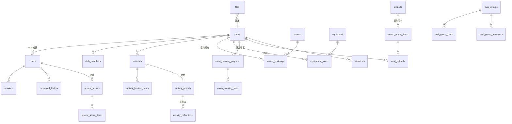

# club-aio 資料模型設計

- 日期:2026-07-13
- 狀態:**草案,待確認**
- 資料庫:PostgreSQL 18;schema 以 Alembic migration 為準,本文件是設計依據
- 慣例:表名 snake_case 複數;主鍵 `id`(整數自增,對外資源另有 uuid 者註明);所有表都有 `created_at`/`updated_at`(TIMESTAMPTZ);金額用 `integer`(新台幣元,無小數)

## 0. 設計原則(未來兼容性的核心)

1. **學年度掛軸**:評鑑、報名、評分、分組等「一年一輪」的資料全部帶 `year`(民國學年度,如 114)。系統可同時保有歷年資料,新學年開新輪,不覆寫舊資料。原型是單年快照,這是它沒表達但正式系統必備的維度。
2. **評分表逐年版本化**:評分項目(rubric)綁 `(award, year)`。學校的評分辦法幾乎年年微調,若把 rubric 寫死在程式碼,每年要改 code + 歷史成績會對不上舊表。版本化後,歷年成績永遠對得上當年的評分表。
3. **推導優於儲存**:器材可借數、逾期與否、結案鎖定、競賽行政分,一律由來源資料即時計算,不存副本(原型存 `avail` 是 demo 簡化)。需要人工介入的地方開**明確的 override 表**(如行政分調整),保留「系統算的」與「人改的」兩層,可稽核。
4. **狀態機 + 簽核紀錄分離**:單據存「目前狀態」一欄;每一次核准/退回/解鎖寫入 `approval_records`(誰、哪一關、決定、原因、何時)。退回原因必填、三關簽核歷程、稽核需求全靠它,狀態欄永遠只是快照。
5. **檔案集中管理**:所有上傳檔進單一 `files` 表(uuid、擁有者、所屬單據、slot),磁碟路徑不進業務表。權限檢查、備份、未來搬物件儲存都只動一處。
6. **帳號單表 + SSO 預留**:四種角色共用 `users` 表,`auth_provider='local'`(預留 `'sso'`),`password_hash` 可空。SSO 上線時只是多一種登入路徑,資料模型不動。
7. **主檔不硬刪**:社團、場地、器材、獎項用 `is_active` 停用;流程單據(申請、借用、成績)永不刪除。行政系統的歷史就是證據。
8. **遷移可重跑**:`legacy_id_map` 記錄舊系統 id → 新 id 對應,migration scripts 以此做到 idempotent,切換前可反覆演練。

## 1. 資料原型盤點(需求覆蓋證明)

### 1.1 原型 HTML(v6)的資料結構 → 新表對應

| 原型結構 | 內容 | 新表 |
|---|---|---|
| `ADMINS` / `staffAccounts` / `clubAccounts` / `VIEWERS` | 四種帳號,含 `pwHistory`、admin `permissions[]`+`super` | `users`、`password_history` |
| `CLUBS` / `clubType` / `clubMeta` | 社團、六種性質、停權(suspended/until/reason)與逾期數 | `clubs`(逾期數改為推導) |
| `state.members` | 社員:姓名/學號/幹部或社員/職稱/時間 | `club_members` |
| 指導老師頁 | 姓名/系所/Email/分機 | `clubs`(advisor_* 欄) |
| 社團簡介頁 | 簡介文字、社團網頁連結(影響評分 ad6) | `clubs` |
| `state.activities` | 活動申請:名稱/類型/日期/時間/地點/校內外人數/內容/工作人員/經費明細/經費來源/核定金額/狀態 | `activities`、`activity_budget_items` |
| `activities[].report` | 結案:五種出席數/亮點/目標/其他/檢討會議/心得(≥3人)/照片/影片連結/核銷金額/檔案 | `activity_reports`、`activity_reflections`、`files` |
| `ACT_STAGES`/`CLOSE_STAGES`/`closeUnlocked` | 三關簽核、結案單關、逾期鎖定與解鎖 | `activities.status`、`approval_records` |
| `state.applications` | 幹部證明/郵局帳戶異動/空間維修 | `officer_certificates`、`postal_account_changes`、`maintenance_requests` |
| `roomBookings` + `PERIODS` | 教室固定借用:教室/多筆(日期,節次)/用途/狀態 | `room_booking_requests`、`room_booking_slots` |
| `bookings`(場地) + `VENUES`/`BK_SLOTS` | 臨時場地借用:場地/日期/節次(1-10,A-D)/用途 | `venue_bookings`、`venues` |
| `bookings`(器材) + `EQUIP`/`SERIAL_CATS` | 器材借用:品項/數量/起訖日/點交(借出人/歸還人/序號)/逾期 | `equipment_loans`、`equipment` |
| `GOV_HOLIDAYS` + `isWorkday` | 逾期規則:結束日之隔天**上班日** 10:30 前未還 | `holidays`(規則進 `system_settings`) |
| `signupItems`/`signups`/`sessionAttend`/`regWindow` | 線上報名(負責人會議含場次、幹訓、競賽報名+選獎項)、場次出席、報名窗 | `signup_items`、`signup_item_sessions`、`signups`、`signup_awards`、`session_attendance`、`system_settings` |
| `AWARDS` + 五套 RUBRIC | 五獎項(團體/個人、加權群組、現場簡報20%)、評分項目 | `awards`、`award_rubric_items` |
| `state.docs` | 競賽資料上傳:club × rubric key × 檔案 | `eval_uploads` + `files` |
| `groups` | 評鑑分組(社團×評審;評審A/B 匿名) | `eval_groups`、`eval_group_clubs`、`eval_group_reviewers` |
| `scores` | 評審評分:每項分數+評語、加減分、簡報分、時間 | `review_scores`、`review_score_items` |
| `scoreOverride`/`clubFinalOverride`/`awardOverride` | 行政分手動調整、總分/獎項覆寫 | `eval_adjustments` |
| `commentRelease`/`evalUnlocked` | 評語開放、行政資料開放 | `eval_settings` |
| `announcements` | 公告:標題/內容/對象(全部/性質/單一社團)/自動 | `announcements` |
| `violations` + `VIOL_ITEMS` | 違規勸導:社團/日期/地點/項目(複選+其他)/填寫工讀生/佐證/銷案狀態 | `violations` + `files` |
| `auditLog` | 稽核:時間/誰/角色/動作/內容 | `audit_logs`(加 `ip`) |
| `AD_RUBRIC` 自動評分 | 行政分:活動申請數/照片/成果單/心得/名單更新/網頁/會議出席/幹訓 | 由來源表推導 + `eval_adjustments` |

### 1.2 舊系統實體 → 覆蓋檢查(功能對等保證)

| 舊系統 | 舊實體 | 新模型對應 |
|---|---|---|
| ClubManagementSystem | club, club_content, club_property | `clubs` |
| | student(社員), teacher(指導老師) | `club_members`、`clubs.advisor_*` |
| | activity, activity_fund, activity_files, activity_images, activity_staff, activity_meta | `activities`、`activity_budget_items`、`files`、`activity_reports` |
| | news | `announcements` |
| | staff(行政帳號), club_token/staff_token(session), club/staff_password_history | `users`、`sessions`、`password_history` |
| | club_record_from_staff(輔導/違規紀錄) | `violations` |
| | audit_activity, audit_activity_record, staff_activity_log | `audit_logs`、`approval_records` |
| | calendar | `holidays` + `system_settings` |
| | viewer.AssessmentDuration(評鑑期間) | `signup_items.deadline`、`system_settings` |
| clubclass | classroom, classroom_rule | `venues`(+節次規則進設定) |
| | apply(教室借用) | `venue_bookings`、`room_booking_requests` |
| | device, device_apply, device_log | `equipment`、`equipment_loans`、`approval_records` |
| | admin, notice | `users`、`announcements` |

兩套舊系統的每個實體都有落點;原型新增的功能(評鑑評分、線上報名、幹部證明、郵局異動、維修、停權)也全數入模。

**CMS 資料遷移現況(2026-07-21,scripts=`migration/cms_import.py`,idempotent)**:
社團/帳號/指導老師/成員/活動(含經費、結案)/公告已遷入 dev 庫(160 社、30,478 成員、14,236 活動)。
密碼不可攜(舊制 sha256(密碼+帳號))→ 全帳號重發一次性密碼+首登強制改密。
**待辦**:(1) 舊機 media 目錄抓回後匯入檔案實體(企劃書/活動照片/附件);
(2) 評鑑檔案庫 Club_clubfiles(12,752 檔、14 分類,新版無對應功能)是否歸檔待需求方決議;
(3) 行政歷史文件 clubrecordfromstaff(7 筆)同上;
(4) 舊 staff「侍筱鳳」帳號 `800` 與偽社團「學務處就輔組」帳號同名,staff 端未遷入待處理;
(5) clubclass(場地器材借用)另套系統,dump 未含,屆時另遷。

## 2. ER 總覽(核心關聯)



(申請三表、公告、稽核、設定為獨立弱關聯,圖中省略)

## 3. 資料表定義

### 3.1 帳號與身分

**users** — 四角色單表

| 欄位 | 型別 | 說明 |
|---|---|---|
| id | serial PK | |
| role | enum(`admin`,`staff`,`club`,`viewer`) | |
| username | text UNIQUE | 登入帳號 |
| password_hash | text NULL | argon2id;SSO 帳號為 NULL |
| auth_provider | enum(`local`,`sso`) default `local` | SSO 預留 |
| name | text | 顯示名稱(社團帳號=社團名) |
| email | text NULL | 通知信箱 |
| club_id | FK clubs NULL | 僅 role=club(一社一帳號) |
| is_super | bool default false | 僅 admin:最高權限 |
| permissions | text[] default {} | 僅 admin:頁面權限鍵(aact/aclose/aapply/areg/abook/aroom/amaint/aviol/amembers…)+ 簽核關卡鍵(`approve_advisor`/`approve_chief`/`approve_dean`)。**學務長=本人操作**:開 admin 帳號僅持 `approve_dean` 與對應待審頁,看不到其他管理功能 |
| can_view_eval | bool default false | 僅 viewer:可否看評鑑資料 |
| must_change_password | bool default true | 行政發放初始密碼,首登強制改密 |
| is_active | bool default true | 停用而非刪除 |
| last_login_at | timestamptz NULL | |
| failed_login_attempts | int default 0 | 登入防爆破:連錯 5 次鎖 15 分(2026-07-14 實作補充) |
| locked_until | timestamptz NULL | 鎖定至;NULL=未鎖定 |

> **選擇單表而非四張角色表**:登入、session、密碼歷史、稽核都以「使用者」為單位,拆表要重複四份;角色專屬欄位僅少數幾欄,NULL 成本遠低於 JOIN 與重複邏輯。**替代:每角色一表**——查詢與外鍵複雜化,未來加角色(如「輔導老師」帳號)要開新表,不採。

**password_history**(user_id, password_hash, changed_at)— 禁止重複使用近期密碼;舊系統已有此制度(club/staff_password_history),保留。

**sessions**(id uuid PK, user_id FK, csrf_token, ip, user_agent, created_at, expires_at)— cookie session 存放處;刪列即登出,停權立即生效。`csrf_token` 為 double-submit CSRF 防護的 session 綁定值(2026-07-14 實作補充)。

### 3.2 社團與主檔

**clubs**

| 欄位 | 型別 | 說明 |
|---|---|---|
| id | serial PK | |
| name | text UNIQUE | |
| kind | enum(社團,學會) | 2026-07-21:負責人顯示詞(社長/會長)推導依據;建立/改名時名稱結尾社/會自動推導、推導不到手動指定,**取代原「名稱強制社/會結尾」規則** |
| en_name | text NULL | 英文名(舊系統 EN_Name 遷入,2026-07-21) |
| attribute | enum(自治性,學藝性,服務性,聯誼性,藝術性,體育性) NULL | 公告分眾、統計用;**停社舊社團原性質不可考 → NULL**(2026-07-21) |
| intro | text | 社團簡介 |
| website_url | text NULL | 影響行政分「網頁經營」(ad6) |
| discord_webhook_url | text NULL | 社團自設 webhook(管理項目,2026-07-13 前端定案);該社事件另推一份 |
| advisor_name / advisor_dept / advisor_email / advisor_ext | text NULL | 校內指導老師(社團自行維護) |
| advisor_out_name / advisor_out_dept / advisor_out_email / advisor_out_phone | text NULL | 校外指導老師(2026-07-21:校內/校外各至多一位) |
| suspended_until | date NULL | 停權至;NULL=未停權 |
| suspend_reason | text NULL | |
| is_active | bool | 退社/未立案=停用 |

> 社長不另設欄位:由 `club_members`(kind=負責人)推導,單一真相。逾期次數同理由 `equipment_loans` 推導。**替代:照原型存 leader/overdue 欄**——與名單/借用紀錄雙寫必然漂移,不採。指導老師=校內/校外各一組欄位(2026-07-21 需求方拍板,取代原單一組;固定兩槽故不抽表)。

**club_members**(id, club_id FK, name, student_id, kind enum(負責人,副負責人,幹部,社員), title text NULL(幹部必填,其他身份選填;2026-07-21 放寬), phone text NULL(2026-07-21 新增,舊系統遷入), semester text(如 114-2), created_at, updated_at;UNIQUE(club_id, student_id, semester))
— 2026-07-16 第九輪定案:**名單按學期各自一份快照**(同學號可跨學期出現;CSV 匯入指定學期,格式 姓名,學號,身份[,職稱[,電話]]);ad5 依「該學期快照是否存在與人數」採計,不再用 updated_at 推導。**正副負責人為一級身份**,顯示詞依 `clubs.kind` 推導(社團→社長、學會→會長;2026-07-21 起不再依名稱末字);「社長/會長」複合形式廢除,CSV 匯入接受顯示詞並映射為標準身份。舊系統入社日期遷入 updated_at。

**venues** — 統一場地主檔(用旗標區分固定/臨時用途;**場地數量與容納人數由管理員後台維護**)

2026-07-15 需求方定案 19 處(seed 與前端 mock 同步):S204 共享食堂 60、S207 60、S209 60、S301 50、S302/S303 90、S304 音樂教室 50、S311 50、S312/S313 90、S314 50、練團室 15、T4 舞蹈區 15、3F 戶外廣場 200、戶外精誠廣場 1–5 各 150、一宿 B2 樓梯 120、一宿 B2 白板 120。**後端 seed 待同步**

| 欄位 | 型別 | 說明 |
|---|---|---|
| id / name / capacity | | 名稱、容納人數 |
| category | enum(教室,練習空間,廣場戶外,宿舍區) | 2026-07-15 增「宿舍區」(一宿 B2) |
| allow_fixed | bool | 可申請「教室固定借用」(教室、練習空間) |
| allow_temp | bool | 可申請「臨時場地借用」 |
| sort / is_active | | 排序、停用 |

**equipment**(id, name, category enum(一般,電子設備,投影布幕,帳篷), total_qty, needs_serial bool, sort, is_active)
— `needs_serial`:電子設備/投影布幕/帳篷點交需登記序號(原型 SERIAL_CATS);可借數 = total − 未歸還中數量,**推導不儲存**。

**holidays**(date PK, name)— 政府行事曆假日;器材逾期判定「隔天上班日 10:30」與行政人員作業日都用它。每年由行政匯入。

**system_settings**(key PK, value jsonb)— 報名窗(regWindow)、結案鎖定月數(CLOSE_LOCK_MONTHS=1)、學期起訖規則、目前學年度、器材歸還時限(10:30)等可調參數。

### 3.3 活動申請與結案

**activities**

| 欄位 | 型別 | 說明 |
|---|---|---|
| id | serial PK | |
| club_id | FK | |
| name / content / location | text | |
| type | enum(社課或會議,活動) | 2026-07-21 二分制(原三分 社課/活動/會議 → 社課與會議合併);僅「活動」可勾大型 |
| is_large | bool default false | 社團申請大型活動(僅 type=活動 可勾);定義:工作人員或服務對象 50 人以上/連辦 2-3 天或逾 20 小時/經費 10 萬以上/籌備 3 個月以上且 5 次以上籌備會議 |
| is_large_approved | bool NULL | 審核時管理員認可;**認可後評鑑行政分才享大型 ×3 加權**(2026-07-14 定案,取代原「類型=大型活動」) |
| date / end_date | date | 活動起訖日期(2026-07-15 需求方:單日改為時間區間;未跨日 end_date=date;學期歸屬與 ad1「一天一件」皆以開始日推導)(2026-07-16 已同步) |
| start_time / end_time | time | 開始時間屬 date、結束時間屬 end_date(2026-07-15;原單日 timeRange)(2026-07-16 已同步) |
| participants_in / participants_out | int | 校內/校外人數 |
| staff_text | text | 工作人員(「總務>陳大文;美宣>…」,自由格式) |
| fund_source | text NULL | 經費來源(輔導老師第一關認定:學務處經費/校務基金/高教深耕…) |
| school_approved | int NULL | 學校核定補助金額 |
| status | enum,見下 | |
| close_unlocked | bool default false | 逾期鎖定的管理員解鎖旗標 |
| close_draft | jsonb NULL | **結案草稿**(2026-07-14 定案:草稿寫 DB,換裝置可續填);不含照片(草稿不保存附件);送出結案時清除。結案資格=approved 且活動已結束(**end_date**+end_time,未填以當日 23:59 計;2026-07-15 起訖區間化) |
| created_by | FK users | |

狀態機(v6 三階層):

```
draft(暫存)
  → pending_advisor(待輔導老師審核)
      ├─ 無申請補助(擬請補助=0):核准 → approved
      └─ 有申請補助:→ pending_chief(待組長) → pending_dean(待學務長) → approved(已核准)
  任一關退回 → rejected(已退回,原因必填,寫入 approval_records;可修改後重送)
approved → [社團送結案] → closing_pending_advisor(結案待輔導老師審核,單關)
  → closed(已結案)   或退回 → approved(帶退回原因)
approved 且 活動結束日(end_date)+1個月 已過 且未送結案 → 「逾期鎖定」(推導狀態,非欄位;close_unlocked=true 可解鎖)
```

**activity_budget_items**(id, activity_id FK, category text(經費科目九項:指導老師教練費/保險費/交通費/膳食費/印刷費/比賽獎勵品/雜支/其他/活動收入,2026-07-13 定案,含 UI 提示文字), description, self_fund int, requested_subsidy int, approved_subsidy int NULL)
— 逐項編列;`approved_subsidy` 由輔導老師關卡逐項核定。科目先用 text + 前端下拉(科目表進 settings),不開表(YAGNI,科目穩定後再說)。

**activity_reports** — 結案成果調查(2026-07-14 需求方改版,取代原型的報名/應到/實到五欄)

| 欄位 | 型別 | 說明 |
|---|---|---|
| activity_id | PK/FK 1:1 | |
| member_count / non_member_count | int NOT NULL | 實際社員/非社員人數(表單 placeholder=申請的校內/校外人數) |
| actual_start / actual_end | time NOT NULL | 實際起訖(預填申請時間;end > start 應用層驗證) |
| actual_location | text NOT NULL | 實際地點(預填申請地點) |
| highlights / goals / others | text NOT NULL | 活動重點/如何達成目標/其他執行狀況(**除影片外全必填**) |
| review_meeting | bool NOT NULL | 檢討會議(2026-07-15 起於結案表單獨立為「二、檢討會議」section);true 時日期/與會人數/討論事項/內容決議皆必填(應用層) |
| review_date | date NULL | |
| review_attendees | int NULL | 與會人數(2026-07-15 新增)(2026-07-16 已同步) |
| review_topics / review_conclusion | text NULL | 討論事項/內容決議(2026-07-15 新增)(2026-07-16 已同步) |
| video_url | text NULL | **唯一選填**;http(s) 格式驗證;照片 <5 張且無影片 → ad2 該活動不計分 |
| expense | int NOT NULL | 實際支出(核銷依據) |
| submitted_at | timestamptz | |

— 照片走 `files`(slot=report_photo;**限 JPG/PNG,魔術位元組+10MB 後端重驗**,sha256 跨活動拒重複);成果報告/心得彙整 PDF 由後端依模板**於下載時動態生成**(不落檔,模板待需求方提供)。

**activity_reflections**(id, report_id FK, student_name, dept(系級), body text)— 送審驗證 ≥3 筆,三欄皆必填。

**approval_records** — 全系統簽核軌跡(通用)

| 欄位 | 型別 | 說明 |
|---|---|---|
| id | serial PK | |
| subject_type | enum(activity, activity_close, room_booking, venue_booking, equipment_loan, officer_cert, postal_change, maintenance, signup) | |
| subject_id | int | |
| stage | text | advisor / chief / dean / single… |
| decision | enum(approve, reject, unlock, revoke) | |
| actor_id | FK users | |
| reason | text NULL | 退回必填(應用層強制) |
| created_at | timestamptz | |

> **選擇通用簽核表而非各單據自帶 reviewed_by 欄**:三關流程一單多筆紀錄,欄位放不下;退回重送再審會產生多輪歷程;「待審申請彙整」與稽核要跨單據查「誰核了什麼」。**替代:每表加審核欄**——只記得住最後一次,歷程遺失,不採。

### 3.4 檔案

**files**

| 欄位 | 型別 | 說明 |
|---|---|---|
| id | uuid PK | 下載網址用 uuid,不可列舉 |
| club_id | FK NULL | 權限邊界(社團只能取自己的) |
| uploaded_by | FK users | |
| subject_type / subject_id | text / int NULL | 所屬單據(結案、維修、郵局、違規、評鑑上傳…) |
| slot | text NULL | 同單據內的位置(report_photo, evidence, passbook…) |
| original_name / size / mime | | |
| sha256 | text | 內容雜湊;評鑑照片上傳以此拒絕重複(檔名不同亦擋),前端先算、後端驗證 |
| path | text | 磁碟相對路徑 `{module}/{YYYY}/{MM}/{uuid}`(月份分類,配合歸檔作業) |
| archived_at | timestamptz NULL | 已由行政備份下載並自磁碟刪除的時間;非 NULL 時 UI 顯示「已歸檔」。競賽採計中的檔案不歸檔 |
| created_at | | |

> 一檔一擁有單據,存取一律經 API 檢查 club_id/角色。**替代:各表自存檔名欄位(原型作法)**——權限檢查與備份邏輯散落各處,搬物件儲存要全改,不採。

**後台「檔案管理」頁**(2026-07-15 新增,前端 `/admin/files` 已落地;後端 API 待做):全系統檔案的空間利用視覺化(依模組分段比例條:活動結案/評鑑資料/活動申請附件/線上申請/空間報修)+ 大型檔案清單(模組篩選)。**報修結案後之照片/影片可於介面直接刪除**(影片佔用大);其餘模組依歸檔政策(archived_at)由行政備份後清理,競賽採計檔案保留。

### 3.5 借用(涵蓋 clubclass 全部功能)

**room_booking_requests**(id, club_id, venue_id(allow_fixed), purpose **NOT NULL**(2026-07-15 用途必填), status enum(pending,approved,rejected), created_at)
**room_booking_slots**(id, request_id FK, **weekday int(1=週一…7=週日)**, period char(1-10,A-D);UNIQUE(request, weekday, period))
— 教室**固定**借用(2026-07-15 需求方重定義,(2026-07-16 已同步)):**整學期每週固定時段**,選項為星期×節次,不再選日期。規則:
  - 僅於**開放窗**受理(system_settings,預設每年 6 月、1 月;未開放時社團端入口反灰移至「其他」)
  - 每社團至多 **10 節**(1 節=1 小時)
  - **晚間時段(第 10 節及 A–D 節)至少連續 3 節**:合法如 9–A、8–10、A–C、B–D;不合法如 9–10、C–D
  - 多社可申請同時段;衝突由管理員**整單擇一核准**(不存在部分同意);核准後借用總覽該時段每週呈深灰(固定借用)
  - 場況圖只顯示**已核准**的固定借用;審核中的固定借用不顯示

**venue_bookings**(id, club_id, venue_id(allow_temp), date, periods char[](複選節次), purpose **NOT NULL**(2026-07-15 用途必填;2026-07-16 已同步), status enum(pending,approved,rejected), created_at)
— **臨時**場地借用,單日多節次。借用總覽(2026-07-15 改版):可借格點擊**直接前往臨時場地借用**(不再彈固定/臨時選單);審核中格不可點;不開放格不畫方框也不列圖例;固定借用改深灰;支援單日檢視(±1 天/±1 週導航)與單一場地 14 天檢視(點場地名稱進入、可翻頁)。

**equipment_loans**

| 欄位 | 說明 |
|---|---|
| id, club_id, equipment_id, qty | 一單一品項(原型如此;多品項=多單,簡單且點交/逾期各自獨立) |
| activity_id | FK activities **NOT NULL**(2026-07-15:器材借用綁定**審核通過活動**,不再自選區間)(2026-07-16 已同步) |
| start_date / end_date | 借用區間=**推導**:活動開始日 −2 個工作天 ~ 活動結束日 +1 個工作天(工作天依 holidays;緩衝天數進 system_settings 可調) |
| purpose | 用途 |
| status | enum(pending, approved, rejected, checked_out(已借出), returned(已歸還)) |
| checkout_by / checkout_at / serials text[] | 借出點交(工讀生;需序號類登記序號) |
| borrower_name | 借用人(借出點交時登記;2026-07-15 借用紀錄需顯示)(2026-07-16 已同步) |
| checkin_by / checkin_at / checkin_note | 歸還點交 |
| returner_name | 歸還人(歸還點交時登記;同上)(2026-07-16 已同步) |

— **逾期=推導**:status=checked_out 且 now > (end_date 之隔天上班日 10:30)。逾期追蹤頁、停權管理、社團 `overdue` 數全由此查詢;工讀生端三頁(借出/歸還/逾期)共用此表。

> **拆三張表而非原型的單一 bookings**:固定借用(週期時段)、臨時場地(單日節次)、器材(區間+點交+序號+逾期)欄位與生命週期完全不同,硬塞一張表會一半欄位恆 NULL 且狀態機混雜。**替代:單表+type**——省一張表但每條查詢都要 filter type、欄位語意靠註解,不採。

### 3.6 其他申請(三表,共用狀態欄慣例)

**officer_certificates**(id, club_id, term(如 114-2), position enum(社長或會長,副社長或副會長), applicant_name, status enum(pending,approved,rejected), created_at)

**postal_account_changes**(id, club_id, reasons text[](事由**複選**:更換代理人,新開戶,印鑑變更,帳簿遺失,結清銷戶,存簿密碼異動;2026-07-13 前端定案,互斥組合由應用層驗證), account_name, account_number, new_agent_name, new_agent_phone, status 同上, created_at)— 存簿影本走 files(slot=passbook)。**2026-07-15 需求方:社團端申請紀錄顯示完整局號帳號(不遮罩)**;後端現行遮罩回應**待同步**。

**maintenance_requests**(id, club_id, location, items text(損壞項目), status enum(pending,in_progress,done), handle_note, created_at)— 佐證照片/影片走 files(slot=evidence)。

> **選擇三張窄表而非單一 applications+JSONB**:三者欄位、驗證、狀態機(維修多「處理中」)都不同;窄表有欄位級約束與型別安全。「待審申請彙整」「我的申請進度」由三表 UNION 出 view(資料量小,毫無壓力)。**替代:單表+type+JSONB payload**——新申請型別免 migration 是唯一優點,但失去 schema 約束、查詢醜陋;新型別本來就該認真設計,不採。

### 3.7 線上報名與出席(2026-07-13 依需求方重設計)

線上報名改為**管理員自訂表單的活動報名系統**:管理員自由建立活動項目並定義報名欄位;社團點進活動子頁填寫;允許多人的活動可逐人新增至上限。

**signup_items** — 報名活動項目(管理員建立)

| 欄位 | 說明 |
|---|---|
| id, year, name, description | |
| is_open / deadline | 開放狀態與截止 |
| event_date, time_text, place, audience | 活動資訊 |
| allow_multiple / max_participants | 是否多人報名與人數上限(單一社團) |
| fields | jsonb:表單欄位定義陣列 `[{key, label, type(text/textarea/radio/checkbox/select), options[], required}]`,如「姓名」「葷/素 單選」「備註」 |
| kind | enum(normal, cadre_training, leader_meeting) | 活動類型(2026-07-14):幹訓/負責人會議有評鑑採計(ad7/ad8),社團端列表顯示彩色標記 |
| session_based / requires_confirmation / is_eval | 場次採計(負責人會議)、需行政確認、競賽報名項 |
| created_by, created_at | |

**signup_item_sessions**(id, item_id FK, name, date, semester)— 場次(如負責人會議 4 場)
**signups**(id, item_id FK, club_id, confirmed bool, created_at;UNIQUE(item_id, club_id))— 一社一單;**一經報名不得更改**(存在即拒絕再送/再存草稿),社團端點擊顯示填寫紀錄
**signup_drafts**(id, item_id FK, club_id, participants jsonb(參加人陣列,同 entries 的 answers 形狀), updated_at;UNIQUE(item_id, club_id))— **報名草稿**(2026-07-14 定案:寫 DB、跨裝置續填);送出報名時刪除;列表以此顯示「草稿」標記
**signup_entries**(id, signup_id FK, answers jsonb(`{field_key: value}`), created_at)— **一人一列**,筆數 ≤ max_participants(應用層強制)
**signup_awards**(signup_id FK, award_id FK)— 競賽報名勾選的獎項
**session_attendance**(id, session_id FK, club_id, attended bool, marked_by FK users, marked_at)— 出席→行政分 ad7

> 欄位定義用 jsonb 而非開表:欄位 schema 是管理員任意定義、逐活動不同、只在該活動生效的資料,正是 jsonb 的正確使用場景;answers 以 field key 對應。注意:活動已有報名後修改 fields 需前端警告(舊 entries 不回填)。

### 3.8 競賽(評鑑)

**awards**(id slug PK:club/finance/activity/result/leader, name, kind enum(團體,個人), has_presentation bool(現場簡報 20%), is_weighted bool(最佳社團獎 行政40%+營運60%), sort, is_active)

**award_rubric_items** — **逐年版本化的評分表**

| 欄位 | 說明 |
|---|---|
| id, award_id FK, year | UNIQUE(award_id, year, item_key) |
| group_label / group_weight | 群組(如「行政資料」0.4)與占比;非加權獎項 weight NULL |
| item_key | ad1/o1/f1/ac1/r1/l1…(上傳槽位與評分項共用鍵) |
| name / max_score / help | 項目、滿分、評分說明 |
| is_admin_item | bool:行政資料項(ad1–ad8,系統自動評分+社團上傳) |
| sort | |

> 新學年由行政「複製上年評分表再修改」,歷年成績永遠對應當年條目。**替代:rubric 寫死在程式碼(原型作法)**——每年改辦法就改 code 重佈署,且歷史成績對不上舊表,不採。

**eval_uploads**(id, year, club_id, rubric_item_id FK, file_id FK, created_at)— 競賽資料上傳:社團 × 項目 × 多檔。

**eval_groups**(id, year, name, sort)/ **eval_group_clubs**(group_id, club_id)/ **eval_group_reviewers**(group_id, user_id, sort)
— 分組與評審指派;`sort` 決定「評審A/評審B」匿名代號。

**review_scores**(id, year, award_id FK, club_id FK, reviewer_id FK users, presentation_score int NULL(簡報 20 分), bonus int, penalty int, submitted_at;UNIQUE(year, award_id, club_id, reviewer_id))
**review_score_items**(id, score_id FK, rubric_item_id FK, score int, comment text)
— 百分比與名次一律推導;草稿機制(原型 localStorage draft)可先做前端暫存,後端不建草稿表(YAGNI)。

**eval_adjustments**(id, year, award_id, club_id, kind enum(admin_score_override(行政分逐項調整), merit_bonus(表現優良加分 0–5), final_override(總分覆寫), award_override(獎項覆寫)), value jsonb, reason text 必填, actor_id, revoked_at timestamptz NULL, created_at)
— 人工調整全部留痕;查詢時「調整值蓋過計算值」,**註銷**(填 revoked_at,不硬刪)即「回到自動計算結果」,歷次調整可稽核。

**eval_settings**(year, award_id, PK(year,award_id), comment_released bool(評語開放社團查看), unlocked bool(行政資料開放))

行政分(ad1–ad8)**不落表**:全部即時彙算,加上 eval_adjustments 的人工調整。這是原型「系統自動評分」的正式化。**計分規則 2026-07-14 定案**(可執行規格見 `frontend/src/features/eval/scoring.ts` + 測試,後端依同規則實作):

| 項目 | 規則 | 資料來源 |
|---|---|---|
| ad1 活動申請 15 | 結案始算;一般 1 分、認可之大型 3 分;**一天至多計 1 件(取當日最高)**;上限 15 | activities(closed, is_large_approved) |
| ad2 照/影片 15 | 每活動照片 ≥5 張**或**影片連結 → 1 分;大型 3 分;上限 15 | files(slot=report_photo)+activity_reports.video_url |
| ad3 成果單 15 | 有上傳即 1 分;大型 3 分;上限 15 | activity_reports |
| ad4 心得回饋 30 | 有上傳即 2 分;大型 6 分;上限 30 | activity_reflections |
| ad5 名單更新 10 | 每學期:0 人 0 分、1–9 人 2.5 分、10 人以上 5 分;兩學期合計 | club_members × semester |
| ad6 網頁經營 5 | **有連結即 5 分**(需求方簡化,不追蹤更新時間) | clubs.website_url |
| ad7 負責人會議 5 | **每場簽到 1.25 分**;每學期 2 場、全學年 4 場滿分 5(2026-07-15 定案,取代「全程參與給滿分」) | session_attendance(kind=leader_meeting;管理員活動後登錄) |
| ad8 幹訓 5 | 幹訓**簽到**即 5 分(2026-07-15:僅報名不計,需管理員登錄簽到) | session_attendance(kind=cadre_training) |
| 加減分 | 表現優良最多 +5(eval_adjustments.merit_bonus);未銷案勸導每筆 −1、上限 −10 | violations(open, 採計期間內) |

- **行政資料總分上限 100**(2026-07-15 定案;各項滿分合計恰為 100,加計表現優良後仍以 100 封頂)
- **簽到採計**(2026-07-15):報名活動結束後由管理員於報名管理登錄簽到(負責人會議記場次數、其餘打勾),評鑑僅採計簽到,**僅報名不計分**;後端 ad7/ad8 彙算**待同步**

### 3.9 公告、違規、稽核、通知

**announcements**(id, title, content, target_type enum(all,attr,club), target_value text NULL(性質名或 club_id), is_auto bool(系統自動通知,如核准訊息), created_by, created_at)

**violations**(id, club_id, occurred_on date, location, items text[](違規項目複選,目錄進 settings), other text, filler_id FK users(工讀生), status enum(open(未銷案), resolved(已銷案)), resolve_note, created_at)— 佐證照片走 files。
— **銷案期限**(2026-07-15 定案,(2026-07-16 已同步)):開立日 +1 個月內須銷案,逾期即**截止**(不再受理銷案,−1 扣分成立);期限與截止皆為推導不儲存,社團端/管理端列表顯示期限,管理端逾期後銷案鈕停用。

**audit_logs**(id, user_id FK NULL, role, action, detail, ip inet, created_at)— 高風險操作全記;不設上限(原型截 500 筆是 demo 限制),量大再做分區/歸檔。

**email_logs**(id, to_addr, subject, template, status enum(sent,failed), error, created_at)— 寄信結果留底,通知糾紛時可查。

### 3.10 遷移輔助

**legacy_id_map**(id, legacy_system enum(cms,clubclass), legacy_table, legacy_id, new_table, new_id, migrated_at;UNIQUE(legacy_system, legacy_table, legacy_id))
— migration scripts 先查 map 再寫入,重跑不重複;對照除錯用。


### 3.x 第五輪後端同步補記(2026-07-16)

- **equipment_loans.start_date/end_date = 申請當下的推導快照**:之後調整工作天緩衝設定不回溯既有借用;逾期判定沿用 end_date。可借數查詢 `GET /club/equipment?activity_id=`(推導區間在 `meta.loan_start/loan_end`);**逾期未還的借用視為持續佔用**(無論原區間是否已過)
- **固定借用每社 10 節上限 = 本單+其他「審核中」申請合計**(核准件屬前學期不佔額度;requests 無 semester 欄的最合理解讀);開放窗 `system_settings.fixed_booking_window` 支援 `open_from/open_until` 日期區間(第八輪起以日期區間為準,月份制淘汰);側欄反灰查 `GET /club/room-bookings/window`
- **簽到登錄** `PUT /admin/signup-items/{id}/attendance`(權限 `areg`):場次制逐場登錄;非場次制自動建立/沿用單一預設場次(session_attendance 單一資料源);場次日期未到/未報名回 409;重複登錄=upsert
- **檔案管理**權限鍵 `afiles`:usage 依 path 前綴分模組、已歸檔不計佔用、`db_size`=pg_database_size(「文字內容」)、有報修檔案時 repair 排第一;刪除僅限 repair 模組(403 其餘),commit 後才 unlink
- system_settings 新 key:`equipment_workday_buffer`({before,after},預設 2/1)、`fixed_booking_window`
- violations 逾期判定同時存在 Python(violation_service)與 SQL(make_interval)兩處實作,邊界=期限當天仍可銷案(已以測試釘住);規則變動需同步兩處

### 3.y 第八輪後端同步補記(2026-07-16)

- **announcements**:`attrs text[]`(性質多選)、`club_id FK`(單一社團)、`takeover_until date NULL`(蓋板截止;期限內社團每次登入全版顯示,顯示邏輯在前端)、`notify bool`;`target_value` 已移除(migration 轉換);content 存 markdown 原文
- **clubs.contact_emails text[]**:聯絡 Email 至多 3 組、第 1 組必填;公告通知寄送對象(Email 全寄+社團自設 Discord webhook 一併推)
- **signup_items**:`event_at`/`signup_start`(建立預設現在)/`signup_end` 皆 timestamptz;`max_participants NOT NULL CHECK >=1`;`requires_confirmation`(審核制:報名 confirmed=False,管理員確認後才成立;未確認不可登錄簽到);移除 `deadline/event_date/time_text/audience/allow_multiple`;fields JSONB 保序=顯示順序
- **audit_logs.user_id FK → ON DELETE SET NULL**:刪除帳號稽核保留;有業務 FK 歷史的帳號刪除回 409(導向停權)
- **system_settings**:`fixed_booking_window={open_from,open_until}`(日期區間,舊 open_months/manual_open 移除;未設定=不開放);`upload_limits={doc,img,zip,video}`;`activity_attachment_total_mb`(預設 50,活動申請附件加總上限);「線上報名時間窗」不再存在(各報名活動自訂起訖)
- **權限鍵別名**:前端 `areview/asignup` 與後端既有 `aact/areg` 任一即通過(`require_permission(*keys)`)

### 3.z 第九輪補記(2026-07-16)

- **signup_items.year 已移除**:ad7/ad8 以「場次日期落在評鑑視窗」推導採計,年度不儲存,不再有對齊隱患
- **club_members**:見上方欄位說明(semester 快照、四值身份、社/會結尾規則)
- **幹部證明**:比對改「學年期(semester)× 身份(負責人/副負責人)」,不再靠職稱字串
- **管理端 router 補齊**:`/admin/clubs`(主檔/改名/啟停/一次性密碼/成員唯讀,amember)、`/admin/venue-bookings`、`/admin/equipment-loans`(含 status=overdue 推導與可借數檢核,abooking)、`/admin/room-bookings`(aroom)、`/admin/bookings/availability`(全校場況,審核中格帶單號供開彈窗)、逾期提醒與停權(super)、公告蓋板 PATCH、維修狀態單步流轉;abooking/aroom/amember 權限鍵定案
- **auth**:`UserOut.club_name`(role=club 補上,前端顯示與社/會推導用)

### 3.aa Task #6 審查補記(2026-07-17)

- **system_settings 新 key `storage_limits`**(`{capacity_gib, per_club_gib, reserve_gib}`,預設 40/2/10;僅 super 於系統設定面板可調):上傳配額於共用 `save_upload()` 收口——pg advisory xact lock 序列化配額檢查、宣告大小預檢+逐塊實際大小+filesystem 保留空間 hard stop;歸檔檔案不佔配額。`capacity_gib` 為**邏輯容量**(含 pg_database_size,與檔案管理頁一致),調高前必須先擴 GCE Persistent Disk;`/admin/files/usage` 回傳 capacity/remaining,前端不再自帶容量常數。超額回 507 `INSUFFICIENT_STORAGE`
- **files 新 partial unique index `uq_files_club_eval_slot_sha`**((club_id, slot, sha256) WHERE active eval_upload):評鑑上傳同槽位去重的 DB 層收口,先查後寫的併發競態由唯一索引攔下(migration `a9c2e51d7f43`)

## 4. 學年與學期規則(已確認)

- **上學期 = 8–1 月、下學期 = 2–7 月**(原型 `semesterOf` 寫反了,以本規則為準)
- 「目前學年度」與學期起訖放 `system_settings`,所有年輪資料寫入時取當前設定,不寫死
- 活動本身只存 `date`,統計與行政分計算時依當年度區間篩選——學年度規則變動不影響歷史資料

### 設定分層原則(需求方指定)

- **恆不變** → `.env`(如 DB 連線、SMTP、secret key)
- **會變/可能變** → `system_settings`,管理員後台即時調整(如報名窗、結案鎖定月數、幹部證明申請時間窗、上傳上限、違規項目目錄、經費科目)

## 5. 已知簡化與升級路徑

| 簡化 | 觸發升級的時機 |
|---|---|
| 經費科目、違規項目目錄放 settings 不開表 | 需要逐科目統計報表時開表 |
| 指導老師單一、存於 clubs 欄位 | 需求出現多指導老師時抽表 |
| 評分草稿只做前端暫存 | 評審反映跨裝置需求時加 draft 表 |
| 器材不做逐台資產管理(僅序號登記於借用單) | 需要維修/報廢生命週期時開 equipment_units |
| 幹部證明產出(PDF)不入模型 | 實作時由資料即時產生,不存檔 |

## 6. 決議補充(2026-07-13)

1. 學期起訖:上學期 8–1 月、下學期 2–7 月(§4)
2. 學務長本人操作,開受限權限帳號(§3.1 users)
3. 幹部證明申請時間窗等規則 → `system_settings`,管理員可調(§4 設定分層)
4. 個資遮罩:郵局局號/帳號顯示前 3 碼 + 末 2 碼、電話顯示末 3 碼;僅具審核權限者於審核詳情頁見完整值(模型不變,API 回應層處理)
5. 競賽「現場簡報 20 分」照原型設計
